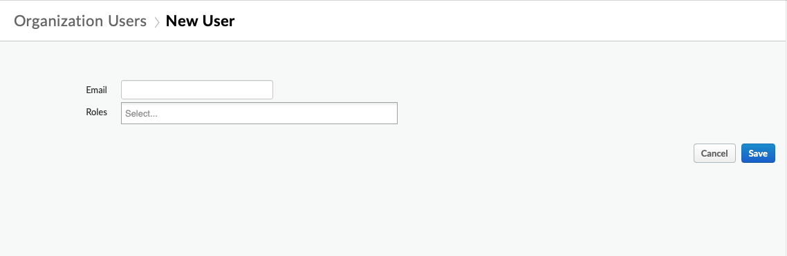

# Apigee Edge User Adder tool

This is a tool that automates the Chrome browser to add users to an Apigee
organization. The term "tool" is generous; it's a gory hack. But it solves a particular problem.

While Apigee is an API-first product, there currently is no published, supported
API for adding a new user to an Apigee SaaS org. The only supported way to do
this is through the user interface.



As a result, a company that wants to add a list of people to an Apigee organization is required to perform a lot of manual clicking.

This tool attempts to ease that problem. It:
- opens a web browser to login to Apigee Edge,
- navigates to a particular organization,
- navigates to the "Add a user" panel,
- and then adds users to a specific role for that organization.

The tool depends on:

- Java 8
- [Selenium](https://www.selenium.dev/documentation/en/) (the library that allows automation of browsers)
- Google Chrome, and [ChromeDriver](https://sites.google.com/a/chromium.org/chromedriver/)
- [Apigee Edge cloud](https://apigee.com/edge)

## See it working

[](https://youtu.be/LdVNz6a6MjU)

## Support status

This tool is not an official Google producct, nor is it part of an official
Google product. It is unsupported. It uses undocumented interfaces which are
subject to change. Depend on this at your own risk.

## Pre-requisites

You need to have Chrome (the browser) installed on your workstation, as well as
[Chromedriver](https://sites.google.com/a/chromium.org/chromedriver/downloads). Be
sure to get the appropriate version of Chromedriver for [your version of
chrome](chrome://version).

This tool works only with Chrome and ChromeDriver.  You must have both Google
Chrome and Chromedriver installed. You could probably modify it to work with other browsers.

You also need Java 8 and maven.

## Building

You should build the tool before using it.

```
mvn clean package
```


## Configuration

You must set some properties for the tool in a Java properties file:
addapigeeuser.properties.  This is a text file. The properties supported within
it are documented.  The program looks for "addapigeeuser.properties" in the
current directory; you can override that location with the -P option.

Example contents of addapigeeuser.properties:

```
org=my-org-name
role=Read-only Organization Administrator
webdriver.chrome.driver=/usr/local/bin/chromedriver
```

You can view [the example properties file](addapigeeuser.properties) for further details.

_In addition to the properties file_ you can specify command  line arguments.  They are summarized here:

| argument | purpose  |
| -------- | -------- |
| -o ARG   | the Apigee org to connect to. |
| -r ARG   | the role to apply to the newly added users. |
| -e ARG   | the list of email addresses (comma separated) to add to that role. |
| -d ARG   | the path to the chromedriver executable. |
| -v       | enable verbose mode. |
| -n       | read Apigee login credentials (username and password) from .netrc. |


## Running the program

### Example 1

This reads from the addapigeeuser.properties file that is local to the
invocation.  The browser page will open. You should manually login. If you
complete that in time, then the browser will automate adding the specified users
to the role in the org, as specified in the properties file.

```
java -classpath ./target/addapigeeuser-20210607.jar:./target/lib/*  \
    com.dinochiesa.tools.AddApigeeUser -v \
    -e person1@example.com,person2@example.com,person3@example.com
```


### Example 2

This does the same as the above, but uses .netrc to find Apigee login credentials. It will automate the login to the Apigee IdP using those credentials, then automate the adding of the specified users to the role in the org, as specified in the properties file.

```
java -classpath ./target/addapigeeuser-20210607.jar:./target/lib/*  \
    com.dinochiesa.tools.AddApigeeUser -v -n \
    -e person1@example.com,person2@example.com,person3@example.com

```

## License

This material is [copyright 2021 Google LLC.](NOTICE) and is licensed under the
[Apache 2.0 License](LICENSE).
